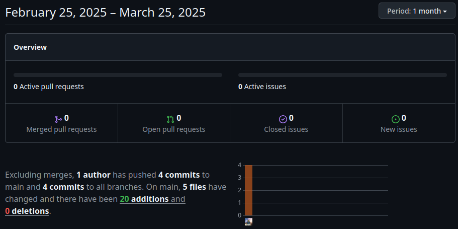

# UI/UX concept sprint

**Name:** Simon Hofer  
**Class:** 2AHITM  
**Projectname:** Velox Custom  
**Link to Github-Repo:** [GitHub Repository](https://github.com/htl-leo-medtwt-projects/2425-sommerprojekt-2ahitm-Wolkenklar/)

## Changes
 - Added
	 - index.html
     - pages/
         - cars.html
     - js/
         - cars.js
         - script.js
         - translation.js
     - css/
         - cars.js
         - script.js
         - translation.js
 - Changed
 - Removed

## GitHub-Insights
 

## Mandatory goals until the next sprint
- Rework all HTML files to use tailwindcss (most of Sprint #1 was used to learn about tailwindcss and how to use it, but there wasn't enough time to use it properly)
- Load cars and manufactures dynamically
- Setup ThreeJS
- Add first concept cars 