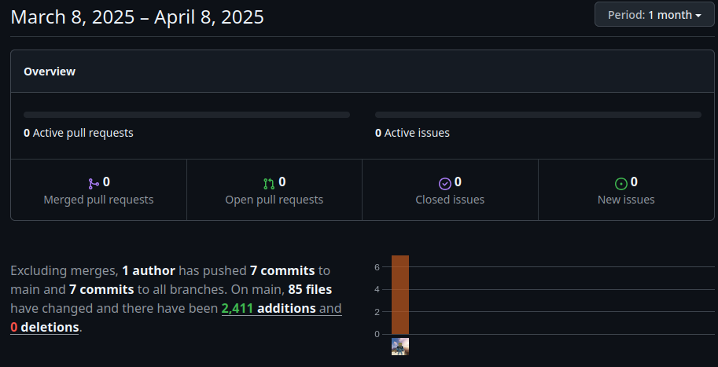

# UI/UX concept sprint

**Name:** Simon Hofer  
**Class:** 2AHITM  
**Projectname:** Velox Custom  
**Link to Github-Repo:** [GitHub Repository](https://github.com/htl-leo-medtwt-projects/2425-sommerprojekt-2ahitm-Wolkenklar/)

## Changes
 - Added
	 - index.html
     - assets/
         - img/
             - thumbnails/
                 - gt3.png (first own render attempt)
         - models/
            - porsche_911.glb
     - pages/
         - cars.html
     - js/
         - configurator.js
     - test/
         - css/
             - input_style.css 
             - input_cars.css
             - input_configurator.css
         - js/
             - configurator.js
         - pages/
             - cars.html
             - configurator.html
 - Changed
     - project/
        - test/
            - package.json (added more commands for easy compiling of css files)
     - documentation/DEV_SPRINT_1.md -> documentation/Sprints/DEV_SPRINT_1.md
     - documentation/UI_UX_KONZEPT_SPRINT.md -> documentation/Sprints/UI_UX_KONZEPT_SPRINT.md
     - documentation/Hofer.fig -> documentation/Prototype/Hofer.fig
     - documentation/Hofer.pdf -> documentation/Prototype/Hofer.pdf
 - Removed
     - project/
         - test/
             - css/
                 - input.css
                 - output.css

## GitHub-Insights
 

## Mandatory goals until the next sprint
- Add more cars (1-2)
- Add addon customisation options
- Add scenery to 3d view
- Add page transitions
- Restructure project for main website to use tailwind, daisyui and threejs
