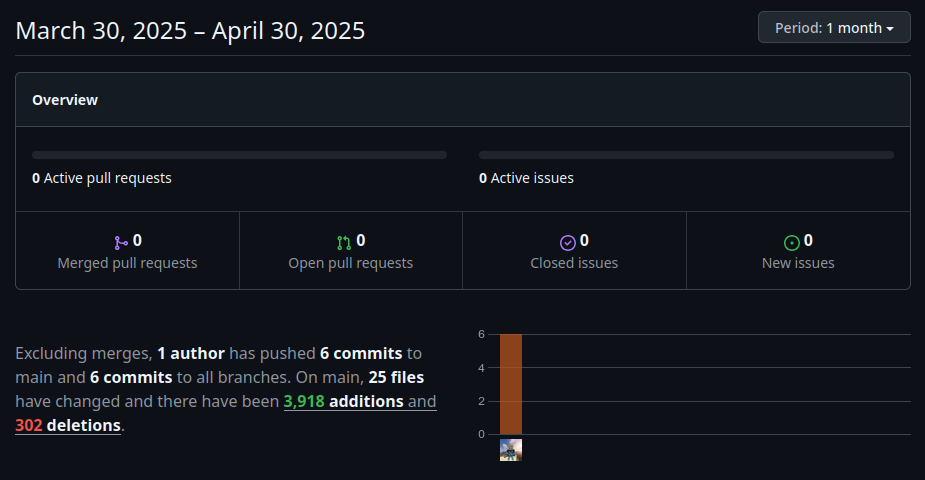

# DEV-SPRINT 3

**Name:** Simon Hofer  
**Class:** 2AHITM  
**Projectname:** Velox Custom  
**Link to Github-Repo:** [GitHub Repository](https://github.com/htl-leo-medtwt-projects/2425-sommerprojekt-2ahitm-Wolkenklar/)

## Changes
- Added
  - 2017 Nissan GTR (textures not working yet)
  - 2017 Nissan GTR mods (textures not working yet)
  - HDR image for 3D view
  - Page transitions
  - js/
    - transitions.js
- Changed 
  - test/ -> project/
  - manufacture -> manufacture**r**
- Removed

## GitHub-Insights
 

## Mandatory goals until the next sprint
- Fix the textures of the Nissan GTR + mods
- Add possibility to download a pdf / image of the car