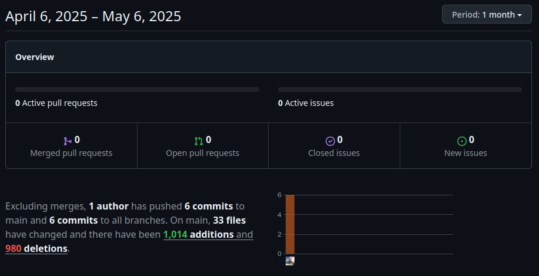

# DEV-SPRINT 4

**Name:** Simon Hofer  
**Class:** 2AHITM  
**Projectname:** Velox Custom  
**Link to Github-Repo:** [GitHub Repository](https://github.com/htl-leo-medtwt-projects/2425-sommerprojekt-2ahitm-Wolkenklar/)

## Changes
- Added
  - 2002 Nissan GTR R34
  - Download Image button
- Changed 
  - The way the scripts are loaded after transitions
- Removed

## GitHub-Insights
 

## Mandatory goals until the next sprint
- Finally fix the textures
- Finally add mods
- Add code functionality
- Use names instead of ids