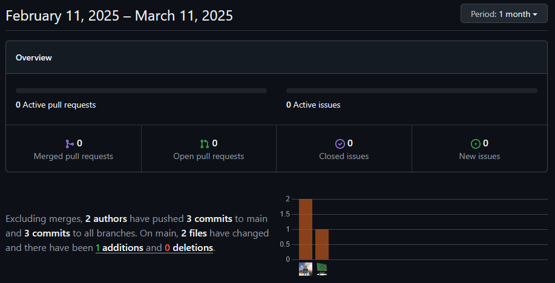

# UI/UX concept sprint

**Name:** Simon Hofer  
**Class:** 2AHITM  
**Projectname:** Velox Custom  
**Link to Github-Repo:** [GitHub Repository](https://github.com/htl-leo-medtwt-projects/2425-sommerprojekt-2ahitm-Wolkenklar/)

## Changes
 - Added
	 - Figma Prototype (fig)
     - Figma Frames (PDF)
 - Changed
 - Removed

## GitHub-Insights
 

## Mandatory goals until the next sprint
- Static HTML/CSS prototype